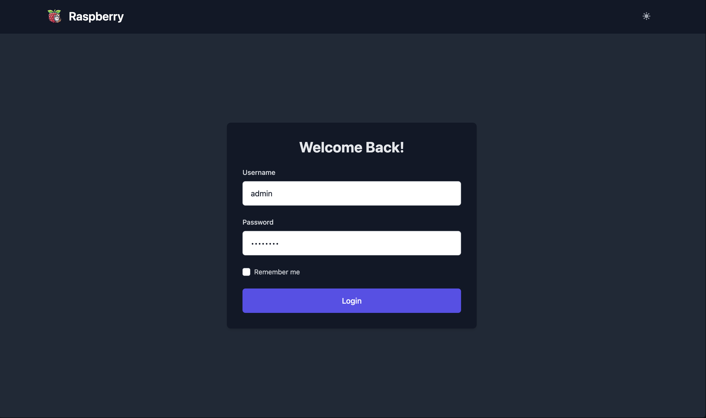
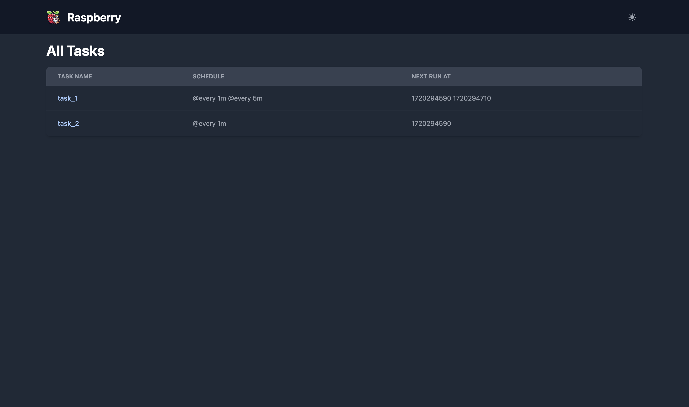
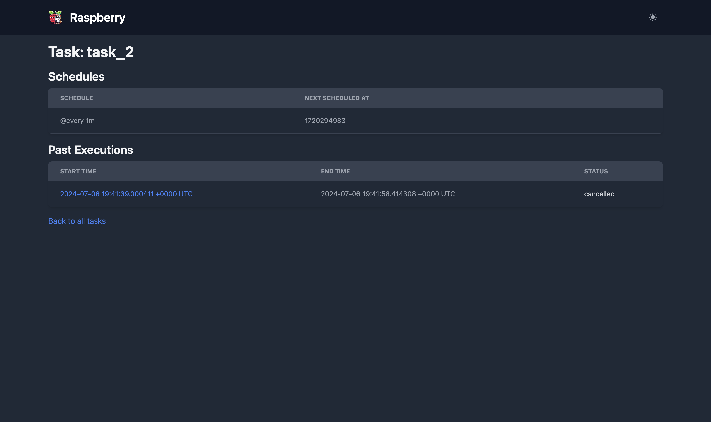
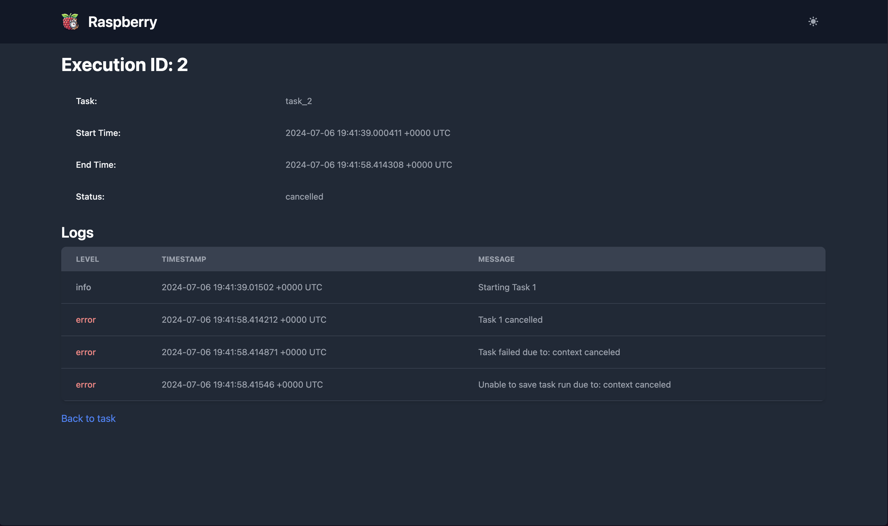
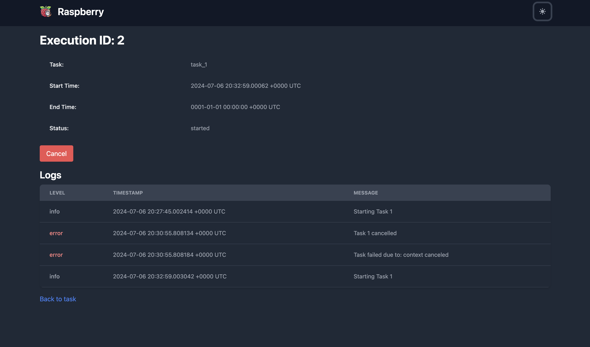
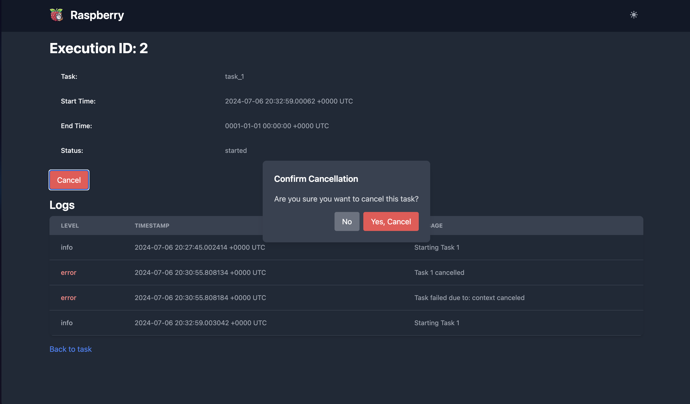
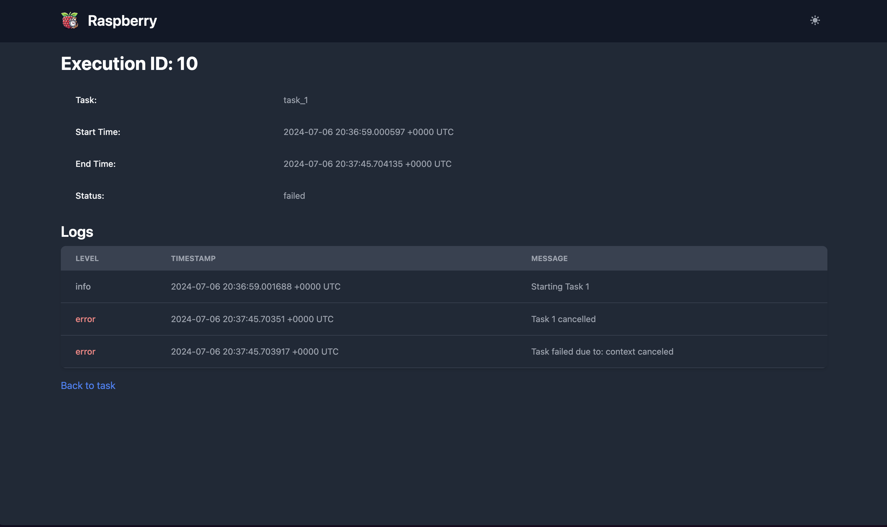
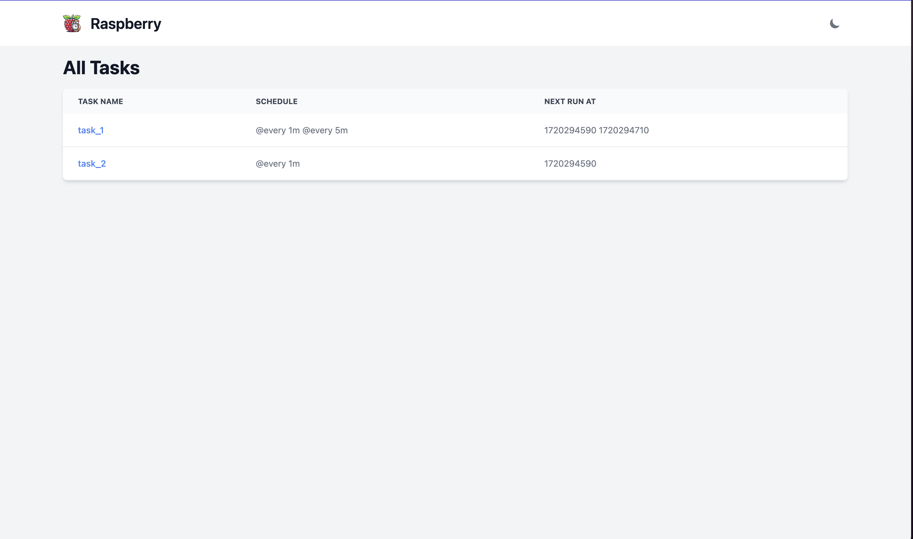

# GUI Showcase

BlueBerry offers a modern web interface with both light and dark mode support.

### Login Page

### Homepage (List all tasks)

### List all schedules and executions

### View Execution Logs (Completed)

### View Ongoing Execution (With Cancel)

### Execution Cancellation Modal

### Execution Post-Cancellation

### Light Mode

